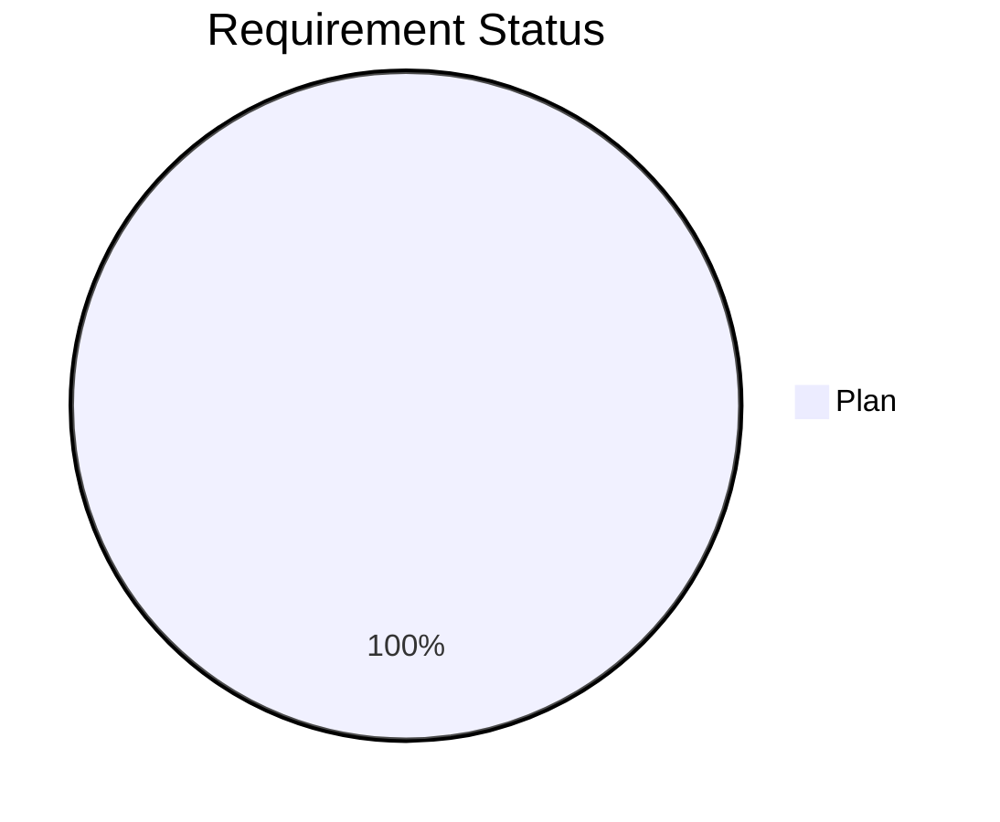
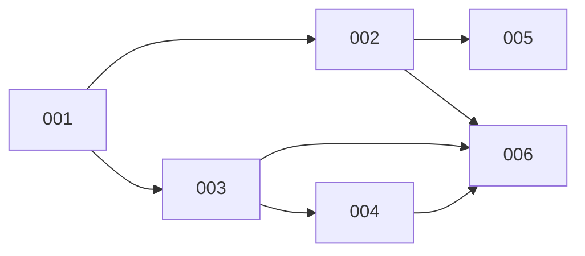

# Project Blueprint

Last updated: 2026-05-30

## Status Distribution



## Progress Bar

```
001 project-skeleton    [████████████████░░░░░░] 70%
002 python-bridge       [██████████████░░░░░░░░] 60%
003 cf-worker           [██████████████░░░░░░░░] 60%
004 web-client          [██████████████░░░░░░░░] 60%
005 hook-scripts        [██████████████░░░░░░░░] 60%
006 pairing-flow        [██████████████░░░░░░░░] 60%

Overall:               [██████████████░░░░░░░░] 60%
```

## Roadmap

| ID | Name | Phase | Status | Dependencies | Priority | Notes |
|---|---|---|---|---|---|---|
| 001 | project-skeleton | 06 Start-and-resume | ⏳ pending | - | P0 | |
| 002 | python-bridge | 04 Plan | ⏳ pending | 001 | P0 | |
| 003 | cf-worker | 04 Plan | ⏳ pending | 001 | P0 | |
| 004 | web-client | 04 Plan | ⏳ pending | 003 | P1 | |
| 005 | hook-scripts | 04 Plan | ⏳ pending | 002 | P0 | |
| 006 | pairing-flow | 04 Plan | ⏳ pending | 002, 003, 004 | P2 | |

**Phase labels:** `01 Init` · `02 Prerequisite` · `03 Algorithm` · `04 Plan` · `05 Tasks` · `06 Start-and-resume` · `07 Execution` · `Round Review` · `07 Done`

**Status labels:** `⏳ pending` · `▶ in-progress` · `⏸ blocked` · `✅ done`

**Priority labels:** `P0` blocking · `P1` core · `P2` nice-to-have

## Progress Summary

```
Total: 6 requirements
✅ Done:  0
▶ Active: 0
⏳ Pending: 6 (all at 04 Plan)
```

## Key Dependencies



## Milestones

| Milestone | Target | Status | Requirements |
|---|---|---|---|
| v0.1 Core Relay | TBD | ⏳ pending | 001, 002, 003, 005 |
| v0.2 Web UI | TBD | ⏳ pending | 004, 006 |

## Effort Overview

| Req | Name | Estimate | Actual | Remaining |
|-----|------|----------|--------|-----------|
| 001 | project-skeleton | M | - | ~3d |
| 002 | python-bridge | L | - | ~5d |
| 003 | cf-worker | L | - | ~5d |
| 004 | web-client | L | - | ~6d |
| 005 | hook-scripts | M | - | ~3d |
| 006 | pairing-flow | S | - | ~2d |
| **Total** | | | | **~24d** |

## Quick Reference

| Document | Location |
|---|---|
| Blueprint | `.dev/blueprint.md` |
| TODO (cross-req) | `.dev/TODO.md` |
| Shared Types | `packages/types/src/protocol.ts` |
| 001 | `.dev/001-project-skeleton/` |
| 002 | `.dev/002-python-bridge/` |
| 003 | `.dev/003-cf-worker/` |
| 004 | `.dev/004-web-client/` |
| 005 | `.dev/005-hook-scripts/` |
| 006 | `.dev/006-pairing-flow/` |
